# Spotify C#:

## 1.  Interfejs graficzny

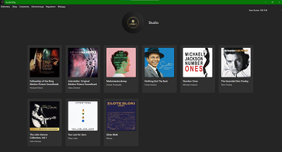
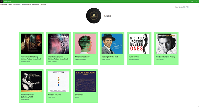

-   Wszystkie elementy w programie posiadają swoje kontekstowe menu,
    umożliwiające użytkownikom szybki dostęp do podstawowych funkcji,
    oraz skróty klawiszowe

-   W celu zmiany logo i nazwy studia, administrator może skorzystać ze
    skrótu klawiszowego Ctrl+L lub Ctrl+N, lub kliknąć prawym
    przyciskiem myszy na wybranym obiekcie i wybrać opcję \"Edytuj\".

-   Aplikacja działa w trybie wielookienkowym, co umożliwia użytkownikom
    swobodne przeglądanie i edycję różnych elementów. Na przykład, po
    kliknięciu na album, użytkownik może wyświetlić listę przypisanych
    do niego utworów, a po kliknięciu na utwór, otworzy się odtwarzacz
    umożliwiający odtworzenie utworu. Podobnie działa to w przypadku
    dostępnych opcji w menu głównym oraz w kontekstowym.

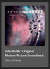
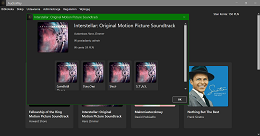
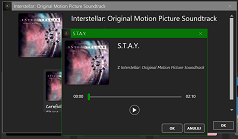

## 2.  Ekran logowania

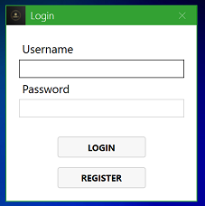
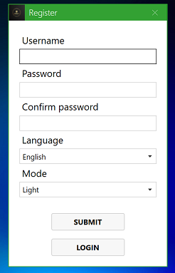

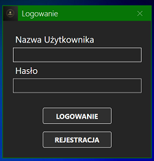
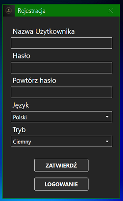

-   Jeśli baza danych nie istnieje, tworzona jest baza standardowa.

-   Pierwszy zarejestrowany użytkownik staje się administratorem
    systemu.

-   Możemy przechodzić między oknami za pomocą skrótów Alt+R (okno
    rejestracji) i Alt+L (okno logowania)

-   W oknie logowania mamy walidację poprawności danych, a w oknie
    rejestracji: nazwa użytkownika od 2 do 32 znaków, hasło co
    najmniej 8 znaków

-   Unikalność nazwy użytkownika jest zagwarantowana poprzez indeksy,
    oraz obsługę błędu w postaci komunikatu

-   Hasła są hashowane w bazie SHA1(SHA1(hasło))

-   Język oraz styl okna są zależne od ustawień systemowych, te
    ustawienia są również domyślnie wybierane podczas rejestracji

## 3.  Regulamin

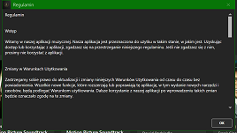
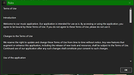

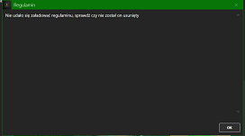
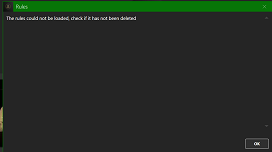

-   Regulamin jest opcją dostępna z menu głównego, bądź za pomocą skrótu
    klawiszowego Alt+T

-   Jest on ładowany z pliku tekstowego (PL.TXT lub ENG.txt)

-   W przypadku braku możliwości otwarcia pliku otrzymujemy zamiast
    niego formułkę w danym języku

## 4.  Profil użytkownika

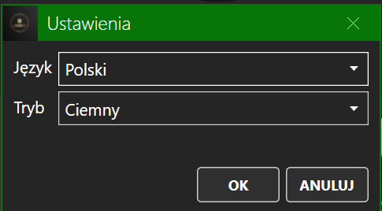

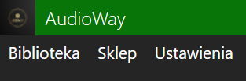
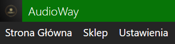

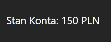

-   Użytkownik ma możliwość wyboru oraz zmiany języka(polski, angielski)
    oraz stylu (jasny, ciemny), które są aplikowane po zalogowaniu

-   Zmiana języka i stylu jest dokonywana przez opcję ustawienia w menu
    głównym, bądź skrót klawiszowy Ctrl+S. Zmiany są aplikowane
    natychmiast (bez ponownego uruchamiania)

-   Użytkownik może przejrzeć posiadane przez niego albumy poprzez opcję
    biblioteka w menu głównym, bądź skrót klawiszowy Alt+L

-   Wylogowania można dokonać z poziomu menu głównego, bądź za pomocą
    skrótu klawiszowego Ctrl+Shift+L

-   Użytkownik ma możliwość podglądu swojego stanu konta w głównym oknie
    programu

## 5.  Handel

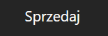

-   Każdy użytkownik ma możliwość sprzedaży oraz kupna albumów (i
    należących do niego piosenek), poprzez menu kontekstowe

-   Cena albumu jest ustalana przez administratora i dostępna w
    podglądzie albumu

-   Albumy należące do użytkownika, ale nie wystawione na sprzedaż,
    posiadają opcję w menu kontekstowym: "Sprzedaj". Po wybraniu tej
    opcji inni użytkownicy mogą dokonać zakupu albumu

-   Po wystawieniu na sprzedaż, dostępna jest nowa opcja - anuluj
    sprzedaż

-   Jeżeli inny użytkownik spróbuje kupić album, który przekracza jego
    możliwości nabywcze, zostanie wyświetlony odpowiedni komunikat

-   Jeśli jednak transakcja się dokona, stanie się on nowym właścicielem
    albumu, a status wystawienia na sprzedaż wróci na wartość fałszywą

-   W celu ułatwienia transakcji kupna i sprzedaży, zalecane jest
    korzystanie z opcji menu głównego: biblioteka (Alt+L), sklep
    (Alt+S)

## 6.  Zarządzanie informacjami o płytach, twórcach i utworach
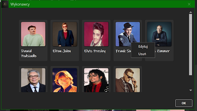
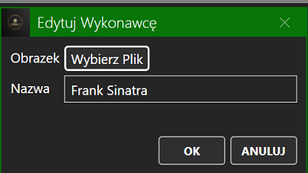

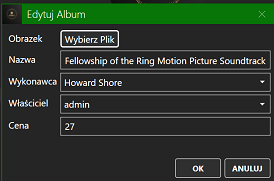
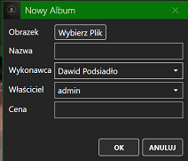

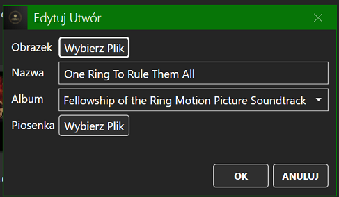

-   Program umożliwia tworzenie, edytowanie oraz usuwanie informacji o
    płytach, twórcach oraz utworach

-   Opcje te są dostępne tylko dla administratora, zarówno na poziomie
    wizualnym (menu kontekstowe) jak i przy użyciu skrótów
    klawiszowych (Ctrl+Shift+N do tworzenia nowego obiektu)

-   Do stworzenia piosenki potrzebny jest album, a do stworzenia albumu
    wykonawca (gdy wykonawców nie ma, bo program jest nowy,
    otrzymujemy stosowny komunikat)

-   Okno wykonawców jest dostępne tylko dla administratora, jako opcja w
    menu głównym, lub pod skrótem klawiszowym Ctrl+A

-   Program informuje za pomocą komunikatów o pustych polach, bądź
    duplikatach nazw

-   Wszystkie dane, łącznie z obrazkami, są przechowywane w bazie danych
    (obrazki i pliki audio w formacie binarnym)

-   Edycja danych jest natychmiastowo odzwierciedlana w programie (np
    wyjście z okna wykonawców po zmiany nazwy jednego z nich jest
    widoczna w wykonawcy albumu)

-   Usuwając wykonawcę posiadającego album, program wymaga wybór jego
    następcy, a gdy jest on ostatnim wykonawcą, operacja usuwania jest
    niedozwolona

-   Usunięcie albumu powoduje usunięcie piosenek w tym albumie

-   Pole Obrazek akceptuje formaty: (jpeg, jpg, png, bmp, gif)

-   Pole Piosenka akceptuje format mp3

## 7.  Zarządzanie użytkownikami
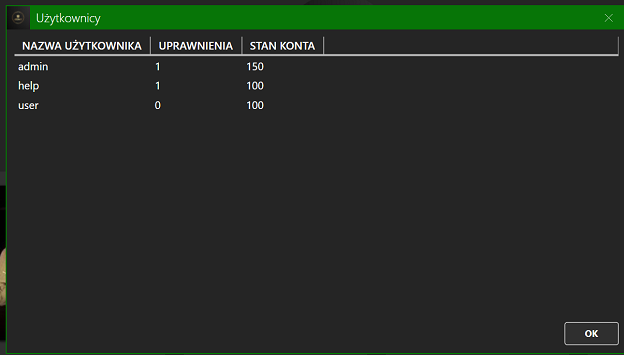

-   Administrator może użyć opcji z menu głównego "Użytkownicy" w sekcji
    "Administracja", lub skrótu klawiszowego Ctrl+U, w celu
    zarządzania zarejestrowanymi użytkownikami

-   Ma on możliwość zmiany nazwy użytkownika, poziomu uprawnień, oraz
    stanu konta

-   W programie wprowadzono walidację uniemożliwiając wprowadzenie
    pustych pól, duplikatu nazwy użytkownika, niewłaściwej wartości
    dla pola uprawnienia (nie 0 ani nie 1), oraz pola stan konta (nie
    liczba)

-   Zmiany są wprowadzane natychmiast po zatwierdzeniu komórki,
    administrator zmieniając swój poziom uprawnień zostanie wyrzucony
    z okna z powrotem do menu głównego, a jego uprawnienia zostaną
    ograniczone. Tak samo w przypadku zmiany własnego stanu konta
    (zmiana będzie widoczna od razu po powrocie do głównego okna)

-   Ponadto, jeżeli użytkownik jest ostatnim administratorem, nie może
    on odebrać sobie uprawnień, musi mianować kogoś innego

## 8.  Obsługa wielu baz danych

-   Wersja produkcyjna programu umożliwia w pełni korzystanie z dwóch
    różnych systemów bazodanowych: MySQL oraz MongoDB

-   Wyboru dokonuje się poprzez zmianę wartości w pliku
    Resources/StandardDBs/baza.txt na "mysql" lub "mongo"

-   Konfiguracja serwera występuje w postaci constrigu w pliku
    Resources/Secret/ "mysql.txt" lub "mongo.txt"

-   Domyślne struktury baz są przechowywane w katalogu
    Resources/StandardDBs

# Autorzy:

Jakub Sułkowski: sporządzenie listy funkcjonalności, strona wizualna
interfejsu dla trybu jasnego i ciemnego, baza MySQL, wypełnianie bazy
danymi, opracowanie logo, regulamin, korekty językowe (eliminacja błędów
ortograficznych, językowych itp.), testy

Piotr Grzegorzek: reszta
